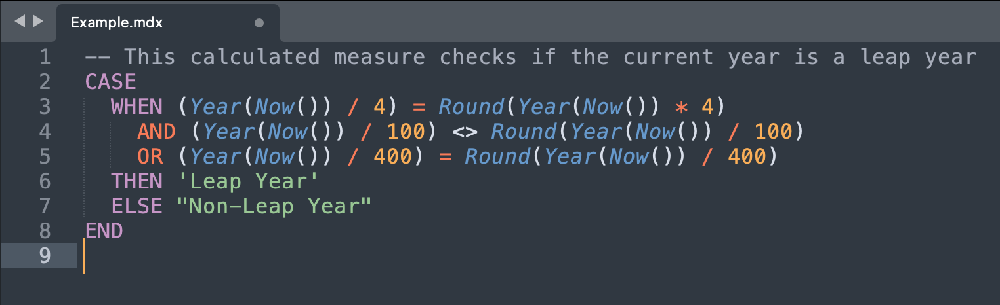

# Sublime Text - eazyBI MDX Syntax Highlighting

This repository contains a Sublime Text syntax highlighting file specifically for the eazyBI variant of the Multidimensional Expressions (MDX) language. This is not to be confused with [MDX (Markdown + JSX)](https://mdxjs.com/), a completely different language used for seamlessly writing JSX in Markdown documents.

MDX is a language for defining and manipulating multidimensional data, which is widely used in Business Intelligence tools. It allows querying and manipulating multidimensional data cubes in a more human-readable format. eazyBI has specific additional MDX functions which are not available in the standard Mondrian OLAP engine, and some general MDX functions may be missing.

This syntax highlighting is specifically tailored to the MDX functions available in [eazyBI](https://docs.eazybi.com/eazybi/analyze-and-visualize/calculated-measures-and-members/mdx-function-reference).

## Installation

1. Download the `eazyBI_MDX.sublime-syntax` file from this repository.
2. Open Sublime Text and click on `Preferences > Browse Packages`. This will open the Sublime Text packages directory.
3. Copy the downloaded `eazyBI_MDX.sublime-syntax` file into the appropriate directory:

    - On MacOS: `/Users/{username}/Library/Application Support/Sublime Text 3/Packages/MDX`
    - On Windows: `C:\Users\{username}\AppData\Roaming\Sublime Text 3\Packages\MDX`
    - On Linux: `~/.config/sublime-text-3/Packages/MDX`
   
   Be sure to replace `{username}` with your actual username on your system.

4. Restart Sublime Text.

After following these steps, Sublime Text should automatically use eazyBI MDX syntax highlighting for files with the `.mdx` extension.

## Contributing

Contributions to improve this syntax highlighting template are very welcome. Feel free to open an issue or submit a pull request.

## License

This project is licensed under the MIT License. See the [LICENSE](LICENSE) file for more details.
