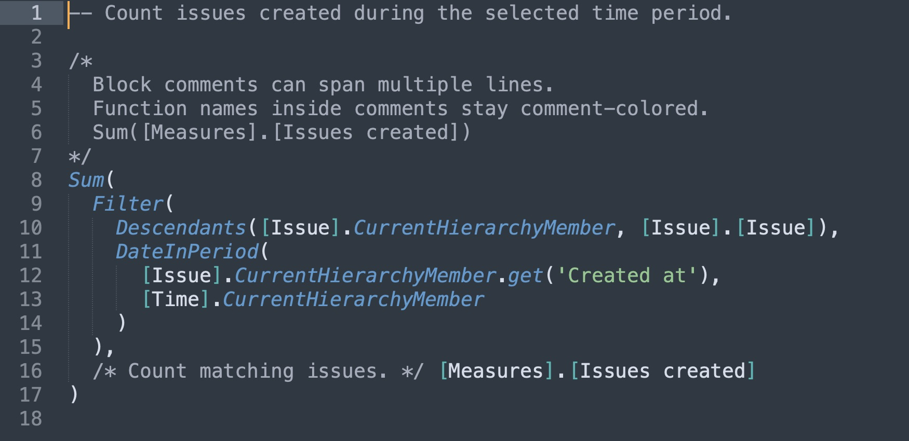

# eazyBI MDX for Sublime Text

Syntax highlighting for eazyBI calculated measures and members in Sublime Text.
This package supports **Multidimensional Expressions (MDX)**, the language used to query OLAP cubes. For the supported eazyBI functions, see the [MDX function reference](https://docs.eazybi.com/eazybi/analyze-and-visualize/calculated-measures-and-members/mdx-function-reference). [Markdown + JSX](https://mdxjs.com/) is a different language that also uses the `.mdx` extension.

## Highlighting

- eazyBI and MDX functions, including `Sum`, `Filter`, `CatchException`, `DateInPeriod`, and `Cast`.
- Control keywords such as `CASE`, `WHEN`, `THEN`, `ELSE`, and `END`.
- Identifiers, brackets, numbers, quoted strings, and arithmetic and logical operators.
- `--` line comments and inline or multiline `/* ... */` block comments.

Tested with **Sublime Text 4215**, including 23 block-comment regression assertions and a visual check. Colors depend on your selected color scheme.

The screenshot uses [example.mdx](example.mdx), a calculated-measure example for an eazyBI Jira cube.

## Installation

### Package Control (recommended)

If needed, [install Package Control](https://packagecontrol.io/installation) first.

1. Open the Command Palette: `Cmd+Shift+P` on macOS, or `Ctrl+Shift+P` on Windows and Linux.
2. Select `Package Control: Install Package`.
3. Search for **eazyBI MDX** and select it.
4. Open a `.mdx` file. The syntax name is **MDX**; if another package handles this extension, choose `View > Syntax > MDX`.

### Manual installation

1. Download [MDX.sublime-syntax](MDX.sublime-syntax).
2. In Sublime Text, choose `Preferences > Browse Packages`.
3. Create a folder named `eazyBI MDX` there and put `MDX.sublime-syntax` inside it.
4. Open a `.mdx` file and select `View > Syntax > MDX` if needed.

A manual `eazyBI MDX` folder takes precedence over the Package Control version. Remove that folder when you want to use Package Control updates again.

## Contributing

[Open an issue](https://github.com/SKrooshof/sublime-eazybi-mdx-syntax/issues) or submit a pull request. For a highlighting bug, include:

- Your Sublime Text build, operating system, and eazyBI MDX package version.
- A minimal MDX example that reproduces the problem.
- The expected highlighting and what you see instead; a screenshot can help.
- Confirmation that the active syntax is **MDX**.

### Run the syntax tests

1. Choose `Preferences > Browse Packages` and create or open the `eazyBI MDX` folder.
2. Copy `MDX.sublime-syntax` and `syntax_test_comments.mdx` from your checkout into that folder.
3. Open the copied `syntax_test_comments.mdx` in Sublime Text.
4. Choose `Tools > Build System > Syntax Tests`, then `Tools > Build` (`Cmd+B` on macOS; `Ctrl+B` on Windows and Linux).
5. Check the output panel for passing results. The current block-comment fixture contains **23 assertions**.

Keep the folder name exactly `eazyBI MDX`: the test header references `Packages/eazyBI MDX/MDX.sublime-syntax`. After editing the syntax or fixture, update the copies before rerunning the tests. See [Sublime Text's syntax-test documentation](https://www.sublimetext.com/docs/syntax.html#testing) for the assertion format.

Open `example.mdx` for a visual check as well: line and block comments should use comment colors, quoted text should use string colors, and highlighting should resume after `*/`.

## License

[MIT](LICENSE).
